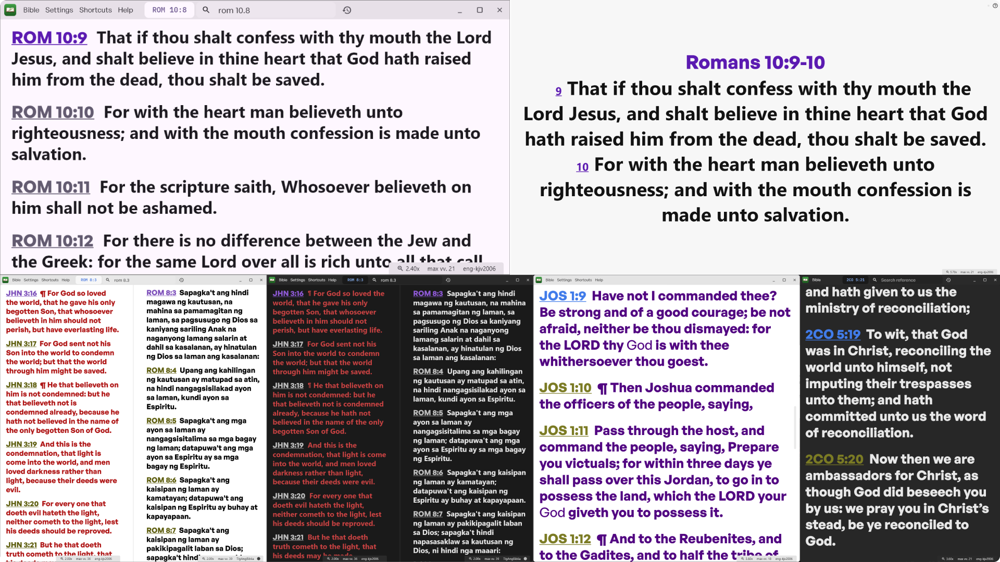

# Open Scripture

Open scripture is a desktop app made for reading and presenting the scripture during church service.
It offers:

- High customization
- List and Presentation view
- Splitscreen and parallel view with different translations
- Clean interface with less clutter
- Shortcuts
- Live overlay graphic for OBS

## Todo

### Features to implement

- enable custom image as background
  - select multiple images and randomly change background
- Searchbar
  - command bar with autocompletion
  - enable search of list of references (insted of querying the whole chapter of one ref)
  - search bible with text tokens
    - Give a list of results
    - Select or use shortcut to view the selected verse's chapter

### Fixes

- Searchbar
  - In split screen, it can't dispatch the same reference consecutively to different panes
- Split screen
  - For some reason when a Pane is swapped, the text_scale_cubit doesn is not. This case another Pane's text_scale to control the other one, and also, when closing the Pane, to dispose of the wrong text_scale_cubit.
