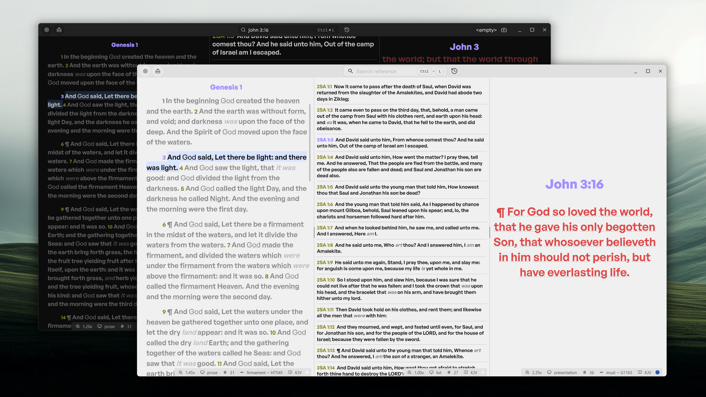

# Open Scripture

Open Scripture is a desktop app for reading and presenting scripture during church services, paired with a mobile companion app for remote control.



## Features

- High customization
- List and Presentation view
- Splitscreen and parallel view with different translations
- Clean interface with less clutter
- Keyboard shortcuts
- Live overlay graphic for OBS _(desktop only)_
- Remote control via the mobile app _(desktop only)_

**Supported platforms:** Windows, Web

## Project Structure

This repo is a monorepo containing two apps:

```
apps/
├── desktop/      # Main desktop app (reading, presentation, OBS overlay etc...)
└── mobile/       # Companion app for remote-controlling the desktop app
packages/shared   # Shared packages between the apps (example: the RC protocols)
```

## Roadmap

Open Scripture is under active development.
Upcoming focus areas include:

- custom image backgrounds
- smarter search/command bar (autocomplete, reference-list search, token-based search).
- bible periscopes
